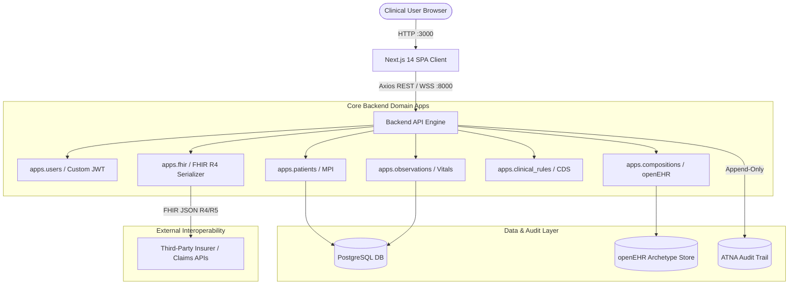

# Clinical EHR & FHIR Architecture Stack

An Educational Implementation of Healthcare Interoperability, Security, and Compliance Frameworks.


[](frontend/README.md)
[](backend/README.md)
[](backend/README.md)
[](docker-compose.yml)
[](https://hl7.org/fhir/)
[](https://www.openehr.org/)
[](docker-compose.yml)
[](LICENSE)

---
## Product Demo


---

## ⚠️ CRITICAL MEDICAL & LEGAL DISCLAIMER

> This project is an educational implementation of Electronic Health Record (EHR) architectures, HL7 FHIR standards, openEHR modeling, and clinical security paradigms. While it incorporates technical safeguards aligned with HIPAA (Health Insurance Portability and Accountability Act) guidelines, this software is neither certified nor guaranteed to be HIPAA compliant.

**DO NOT USE THIS SYSTEM WITH REAL PATIENT HEALTH INFORMATION (PHI) OR IN PRODUCTION CLINICAL ENVIRONMENTS. Deployment with real patient data requires a comprehensive institutional compliance review, formal operational controls, administrative workflows, business associate agreements (BAAs), and legal infrastructure.**

---

## 📚 Stack Sub-System Documentation Index

For detailed engineering, setup instructions, and domain specific schemas across each tier of the stack, refer to the individual module guides:

- ⚙️ **[Backend API Engine](backend/README.md)**  — ASGI REST API, HL7 FHIR serializers, openEHR archetypes, custom JWT auth, and ATNA audit logging.

- 🎨 **[Frontend README](frontend/README.md)** — Next.js 14 App Router, TanStack Query, Zustand store, shadcn/ui design system, and client RBAC matrix.

- 🐳 **[Infrastructure README](infra/README.md)** — Multi stage Dockerfiles, PostgreSQL containerization, and docker-compose orchestration.


---

## 🌟 Overview

The Clinical EHR & FHIR Architecture Stack is an enterprise grade blueprint designed to explore the intersection of modern web engineering and strict clinical data governance. It demonstrates how to build an interoperable, highly secure, and audit defensible health informatics ecosystem using a high concurrency Python backend paired with a type safe Next.js Single Page Application (SPA).

This project addresses the modern dilemma of healthcare software: balancing rapid, decoupled API-driven layout rendering with the immutable constraints of patient data privacy, role restricted clinical isolation, and semantic diagnostic accuracy.

---

## 🗺️ High Level System Architecture


---

## 🏗️ Core Architectural Pillars
The architecture is systematically decoupled across six functional pillars:

1. **HIPAA Aligned Technical Safeguards**
Engineered to emulate the technical safeguards required under 45 CFR § 164.312:

- Access Control: Enforcing unique user identification, role based resource scopes, and automatic front to back session termination policies.

- Transmission Security: Guarding against unauthorized modification of PHI during transit through strictly enforced HTTP header contexts, token validation handshakes, and database transaction protection blocks.

2. **FHIR Interoperability (HL7) & Data Portability**
Implements native structures compliant with Fast Healthcare Interoperability Resources (FHIR) Release 4/5:

- Resource Modeling: Mapping object relational schemas to standard FHIR JSON representations (e.g., Patient, Observation, Encounter).

- B2B Interoperability Layer: Exposes read only FHIR serialization schemas. This allows third party integrations such as dedicated insurance risk underwriting and claims handling applications to query authorized data points transparently without polluting the clinical model layer.

3. **openEHR Modeling Concepts**
Leverages the structural concepts popularized by openEHR:

- Semantic Separation: Keeping the underlying structural database schemas stable while shifting fluid clinical domain knowledge into configurable, logical entry representations.

- Hierarchical Repositories: Structuring query boundaries to manipulate deeply nested, sequential clinical entries (Compositions) without suffering from relational database schema rigidity.

4. **Custom JWT & Frontend RBAC Sync**
A zero trust access network tailored for multi tenant hospital environments:

- Enhanced Token Payloads: Extends default token mechanics via a customized token-obtain pipeline. Upon verification, the login endpoint actively ships user metadata (role, email, names) inside the encrypted validation payload.

- Granular Sidebar Filtering: The Next.js frontend listens directly to this synchronized token lifecycle. It utilizes strict client side verification to automatically compile individual navigational footprints based on user functional matrices (e.g., ADMIN, DOCTOR, NURSE, AUDITOR, INSURER).

5. **Compliance & Security Audit Logging**
An absolute, tamper evident record of all system interactions:

- Full Attribution: Every read, write, or modification captures the precise Who, What, When, Where, and Why of PHI access.

- ATNA Alignment: Emulating Audit Trail and Node Authentication integration profiles, capturing database level transaction diffs linked directly to the initiating authenticated session context.

6. **Robust Type Safe Engineering**
Type Guarding: Incorporates explicit None barrier guards and dynamic lookup routing to eliminate static stub type checking errors.

- Optimized Persistence Engine: Engineered to resolve complex relational deadlock states using clean transaction workflows, optimized indexing strategies, and optimized PostgreSQL execution paths.

---

## 📂 Project Directory Structure

```Plaintext

Clinical-Ehr-Fhir-Stack/
├── docker-compose.yml             # Multi container orchestrator (DB, Backend, Frontend)
├── README.md                      # Global architecture overview (This file)
│
├── backend/                       # Python REST API Engine
│   ├── README.md                  # Backend setup, domain app breakdown, & API endpoints
│   ├── backend.Dockerfile         # Lightweight Python 3.12 container specification
│   ├── requirements.txt           # Python dependencies
│   ├── config/                    # Core project configurations (asgi, settings, urls)
│   └── apps/                      # Modular Domain Applications
│       ├── audit_logs/            # ATNA audit trail engine
│       ├── clinical_rules/        # CDS rule evaluator
│       ├── compositions/          # Clinical document compositions
│       ├── fhir/                  # HL7 FHIR R4/R5 transformation layer
│       ├── observations/          # Vital signs and lab telemetry
│       ├── openehr/               # Archetype models & templates
│       ├── patients/              # Master Patient Index (MPI)
│       └── users/                 # Custom JWT auth & RBAC enforcement
│
└── frontend/                      # Next.js 14 App Router SPA
    ├── README.md                  # Frontend setup, state architecture, & UI components
    ├── frontend.Dockerfile        # Node 20 Alpine production container
    ├── package.json               # Dependencies (shadcn/ui, TanStack Query, Zustand)
    ├── app/                       # Page routes (patients, observations, audit logs, etc.)
    ├── components/                # UI layout & FHIR rendering components
    ├── store/                     # Zustand persistent state containers
    └── types/                     # TypeScript FHIR & domain type definitions
```
---

## 🚀 Quick Start with Docker Compose
The fastest way to spin up the complete ecosystem (PostgreSQL database, API Backend, and Next.js SPA) is using Docker Compose.

1. Clone & Configure

```Bash
git clone https://github.com/your-org/Clinical-Ehr-Fhir-Stack.git
cd Clinical-Ehr-Fhir-Stack

# Create local environment configuration
cp .env.example .env
```

2. Launch the Stack
   
```Bash
docker compose up -d --build
```
3. Verify System Services

| Service | Host URL | Container Port | Description |
| ------- | -------- | -------------- | ----------- |
| Next.js SPA Frontend | http://localhost:3000 | 3000 | Web user interface |
| API Backend Engine | http://localhost:8000 | 8000 | API endpoints & OpenAPI Swagger docs |
| PostgreSQL Database | localhost:5432 | 5432 | Relational clinical data store |

---

## 🛠️ Local Native Development Setup

If you prefer running services outside of Docker containers:

Backend Setup

```Bash
cd backend
python -m venv venv
source venv/bin/activate  # On Windows: venv\Scripts\activate
pip install -r requirements.txt
python manage.py migrate   # or alembic upgrade head
python manage.py runserver # or uvicorn app.main:app
```

For deep-dive backend instructions, see the Backend README.

Frontend Setup
```Bash
cd frontend
npm install
npm run dev
```

For complete frontend state and component guides, see the Frontend README.

---

## 📜 License & Acknowledgments

This project is released under the [MIT License](https://mit-license.org/). Built for educational research into open standards including HL7 FHIR R4/R5, openEHR, and IHE ATNA profiles.