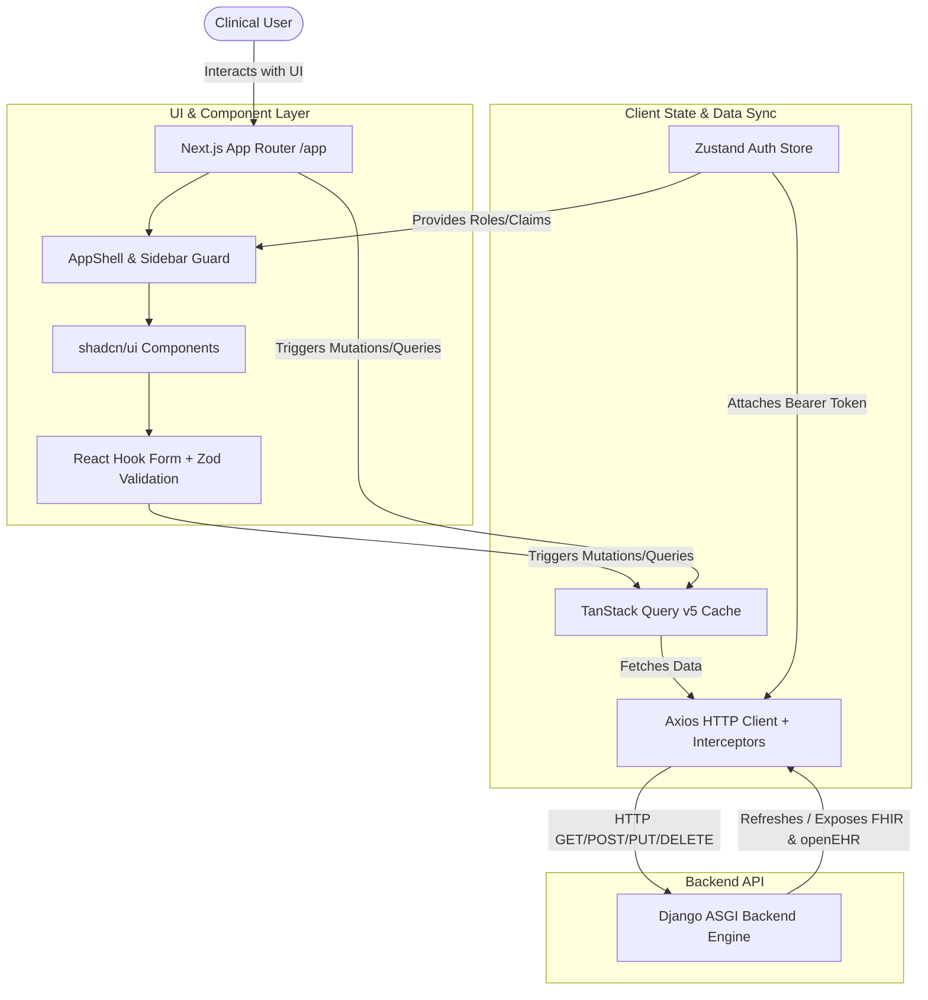
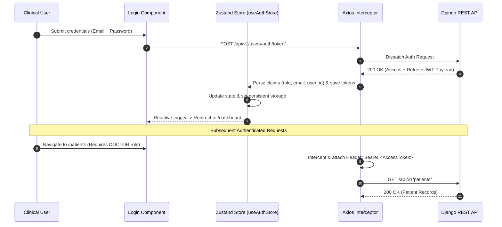

# Clinical EHR & FHIR Frontend Client

A type safe, accessible Single Page Application (SPA) built with Next.js App Router, shadcn/ui, and Tailwind CSS. It powers the clinical interface for the Clinical EHR & FHIR Architecture Stack, featuring dynamic Role Based Access Control (RBAC) navigation, real time query caching via TanStack Query, centralized session state through Zustand, and fully typed Axios API clients.

[](https://nextjs.org/)
[](https://react.dev/)
[](https://www.typescriptlang.org/)
[](https://tailwindcss.com/)
[](https://ui.shadcn.com/)
[](https://tanstack.com/query)
[](https://zustand-demo.pmnd.rs/)
[](https://axios-http.com/)

---

## ⚠️ Critical Medical & Legal Disclaimer

> This application is an educational frontend reference implementation designed for demonstrating health informatics user interface design, clinical workflow modeling, and client-side access control patterns.

- No Production Certification: This client is not certified for HIPAA compliance or clinical deployment.

- Prohibited Data: NEVER input, process, or render actual Protected Health Information (PHI) or Personally Identifiable Information (PII) in non certified environments.

- Access Control Limitations: Client side RBAC visual filtering is provided solely for user experience. All security boundaries and permission enforcement must occur on the backend API server.

---

## 🏗️ Architecture & Data Flow

The client operates on a decoupled data pipeline. Upon authentication, JWT claims are stored and parsed into local state, driving reactive navigation, automated token refreshes via Axios interceptors, and cached API requests.


---

## 🔒 Authentication & Reactive RBAC Synchronization

The auth workflow extracts authorization claims directly from the JWT payload to maintain zero latency client side view composition.


---

## 💻 Tech Stack & Key Libraries

- Framework: Next.js 14+ (App Router, Client Components, Static Route Shells)

- Styling & Design System: Tailwind CSS + shadcn/ui (Radix UI Primitives)

- Server State & Caching: TanStack Query v5 (@tanstack/react-query)

- Client State Management: Zustand with persist middleware

- HTTP & API Integration: Axios with global request/response interceptors

- Type System: TypeScript 5 strict mode with centralized FHIR/openEHR interfaces

### 🔐 Client Side RBAC Matrix

The navigation sidebar``` (components/layout/Sidebar.tsx)``` dynamically renders routes based on the user's role extracted from the authenticated JWT token payload:

| Route Path | View / Feature | Required Role(s) |
| ---------- | -------------- | ---------------- |
| /dashboard | Clinical activity summaries & system health metrics | All Authenticated Users |
| /patients | Master Patient Index search & demographic lookup | ADMIN, DOCTOR, NURSE |
| /patients/register | New patient intake & identifier assignment | ADMIN, DOCTOR |
| /observations | Vital signs, telemetry charts, and lab results | ADMIN, DOCTOR, NURSE |
| /compositions | openEHR structured clinical document browser | ADMIN, DOCTOR |
| /fhir-explorer | Interactive FHIR R4 JSON document transformer | All Authenticated Users |
| /audit-logs | ATNA compliance and security access event viewer | ADMIN, AUDITOR |

---

## 📁 Repository Directory Structure

```Plaintext
frontend/
├── app/                        # Next.js App Router routes & page compositions
│   ├── (auth)/
│   │   └── login/
│   │       └── page.tsx        # Authentication entry point
│   ├── (dashboard)/
│   │   ├── audit-logs/
│   │   │   └── page.tsx        # ATNA Audit Trail Viewer
│   │   ├── compositions/
│   │   │   └── page.tsx        # openEHR Compositions Explorer
│   │   ├── fhir-explorer/
│   │   │   └── page.tsx        # FHIR R4 JSON Inspector
│   │   ├── observations/
│   │   │   └── page.tsx        # Vital signs & telemetry metrics
│   │   ├── patients/
│   │   │   ├── page.tsx        # Master Patient Index (MPI) Table
│   │   │   └── register/
│   │   │       └── page.tsx    # Patient Registration Form
│   │   ├── dashboard/
│   │   │   └── page.tsx        # Role adapted summary view
│   │   └── layout.tsx          # Wrapped layout housing AppShell & Sidebar
│   ├── layout.tsx              # Root HTML wrapper with TanStack Provider
│   └── page.tsx                # Index redirect controller
├── components/                 # Reusable UI component library
│   ├── layout/
│   │   ├── AppShell.tsx        # Master UI viewport framework
│   │   ├── Header.tsx          # User profile display & active context bar
│   │   └── Sidebar.tsx         # Dynamic RBAC driven navigation bar
│   ├── ui/                     # shadcn/ui components (Button, Dialog, Table, etc.)
│   └── fhir/
│       └── FhirJsonViewer.tsx  # Syntax highlighted FHIR resource renderer
├── hooks/                      # Custom React Hooks
│   ├── useAuth.ts              # Authentication & JWT helper hook
│   └── usePatients.ts          # Wrapped TanStack Query hook for patient APIs
├── lib/                        # Core utilities and client instances
│   ├── api/
│   │   └── axiosClient.ts      # Axios instance configured with refresh interceptors
│   ├── utils.ts                # Tailwind merge (cn) & formatting helpers
│   └── validators/             # Zod form validation schemas
├── store/                      # Zustand state containers
│   └── useAuthStore.ts         # Token storage, role tracking, and local state persistence
├── types/                      # TypeScript definitions & FHIR/openEHR models
│   ├── api.ts                  # Backend response primitives
│   ├── fhir.ts                 # Standard HL7 FHIR R4 schema definitions
│   └── user.ts                 # Auth roles, claims, and permission definitions
├── public/                     # Static assets, branding, and icons
├── tailwind.config.ts          # Design token definitions & shadcn/ui theme extensions
├── tsconfig.json               # Strict TypeScript configuration
└── package.json
```
---

## 🛠️ Local Environment Setup

1. Prerequisites
- Node.js: v18.17.0 or later

- Package Manager: npm (v9+) or pnpm / yarn

2. Installation Steps
Navigate to the ```frontend/``` directory:

```Bash
cd frontend
```

Install application dependencies:

```Bash
npm install
```

Set up environment variables by creating a ```.env.local``` file in the ```frontend/``` root:

```Bash
# URL pointing to the Django REST ASGI backend engine
NEXT_PUBLIC_API_BASE_URL=http://127.0.0.1:8000/api/v1
```

Run the local development server with hot reload:

```Bash
npm run dev
```

Open ```http://localhost:3000``` in your browser.

> Tip: If switching between user roles during testing, clear stale local session storage by executing localStorage.clear() in your browser developer tools console.

3. Build & Production Verification
   
To build and verify the optimized production output locally:

```Bash
npm run build
npm run start
```