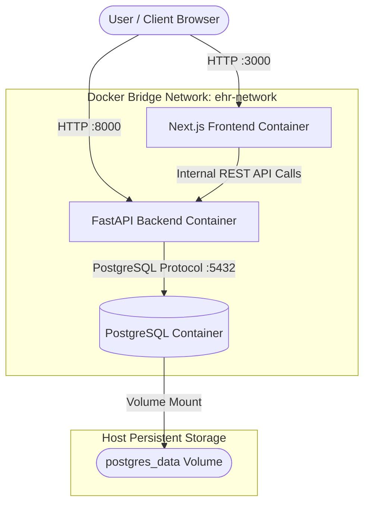

# Clinical EHR & FHIR Infrastructure Stack

Containerized deployment, multi stage Docker builds, and orchestration definitions for the Clinical EHR & FHIR Architecture Stack. This setup provisions isolated runtime environments for the high concurrency API backend, Next.js SPA frontend, and PostgreSQL persistent database engine.

[](https://www.docker.com/)
[](https://docs.docker.com/compose/)
[](https://hub.docker.com/_/python)
[](https://hub.docker.com/_/node)
[](https://hub.docker.com/_/postgres)

---

## ⚠️ Critical Infrastructure & Security Disclaimer

> This infrastructure specification is configured for local development and educational benchmarking.

- No Production Safeguards: Default configurations use development secrets, unencrypted volume mounts, and non hardened networking profiles.

- Prohibited Data: DO NOT process or store actual Protected Health Information (PHI) inside these container volumes without enabling at rest volume encryption (e.g., LUKS, AWS KMS), TLS termination at an ingress controller, secret key vault integration, and formal HIPAA administrative controls.

---

## 🏗️ Container Orchestration Architecture

The system uses docker compose to manage container lifecycles, internal service networks, persistent volume bindings, and health check dependencies.


---

## 🐋 Container Blueprint Breakdown

1. Backend Container (```backend.Dockerfile```)
Built on a lightweight Python 3.12 slim image. It leverages Docker layer caching by isolating dependency installation from application source code.

```Dockerfile
# Use an official lightweight Python image
FROM python:3.12-slim

# Set environment variables to optimize Python execution inside Docker
ENV PYTHONDONTWRITEBYTECODE=1
ENV PYTHONUNBUFFERED=1

# Set the working directory inside the container
WORKDIR /code

# Copy only the requirements file first to leverage Docker cache
COPY ./requirements.txt /code/requirements.txt

# Install dependencies without saving cache to keep image size small
RUN pip install --no-cache-dir --upgrade -r /code/requirements.txt

# Copy the rest of the application code into the container
COPY ./app /code/app

# Expose port 8000 for network routing
EXPOSE 8000

# Run the FastAPI application using the built-in CLI command
CMD ["fastapi", "run", "app/main.py", "--port", "8000"]
```

2. Frontend Container (```frontend.Dockerfile```)

Built on Alpine Linux to maintain a minimal container footprint. It installs dependencies, compiles optimized Next.js static pages, and runs the Node.js production server.

```Dockerfile
# Use the standard Node image
FROM node:20-alpine

# Set the working directory
WORKDIR /app

# Copy package files and install dependencies
COPY package.json package-lock.json* ./
RUN npm install

# Copy the rest of your project files
COPY . .

# Build the Next.js production application
RUN npm run build

# Expose the default Next.js port
EXPOSE 3000

# Start the application in production mode
CMD ["npm", "run", "start"]
```

3. Root Orchestration (```docker-compose.yml```)
   
Coordinates the database, backend, and frontend containers into a single isolated bridge network with automatic health dependency checks.

```YAML
version: '3.8'

services:
  # ---------------------------------------------------------------------------
  # 1. PostgreSQL Database Service
  # ---------------------------------------------------------------------------
  db:
    image: postgres:16-alpine
    container_name: ehr-postgres-db
    restart: always
    environment:
      POSTGRES_DB: ${POSTGRES_DB:-ehr_db}
      POSTGRES_USER: ${POSTGRES_USER:-ehr_user}
      POSTGRES_PASSWORD: ${POSTGRES_PASSWORD:-ehr_secure_password}
    ports:
      - "5432:5432"
    volumes:
      - postgres_data:/var/lib/postgresql/data
    healthcheck:
      test: ["CMD-SHELL", "pg_isready -U ${POSTGRES_USER:-ehr_user} -d ${POSTGRES_DB:-ehr_db}"]
      interval: 5s
      timeout: 5s
      retries: 5
    networks:
      - ehr-network

  # ---------------------------------------------------------------------------
  # 2. FastAPI API Backend Service
  # ---------------------------------------------------------------------------
  backend:
    build:
      context: ./backend
      dockerfile: backend.Dockerfile
    container_name: ehr-backend-api
    restart: unless-stopped
    environment:
      DATABASE_URL: postgres://${POSTGRES_USER:-ehr_user}:${POSTGRES_PASSWORD:-ehr_secure_password}@db:5432/${POSTGRES_DB:-ehr_db}
      SECRET_KEY: ${SECRET_KEY:-super-secret-development-key}
      ALLOWED_HOSTS: "*"
    ports:
      - "8000:8000"
    depends_on:
      db:
        condition: service_healthy
    networks:
      - ehr-network

  # ---------------------------------------------------------------------------
  # 3. Next.js SPA Frontend Service
  # ---------------------------------------------------------------------------
  frontend:
    build:
      context: ./frontend
      dockerfile: frontend.Dockerfile
    container_name: ehr-frontend-spa
    restart: unless-stopped
    environment:
      NEXT_PUBLIC_API_BASE_URL: http://localhost:8000/api/v1
    ports:
      - "3000:3000"
    depends_on:
      - backend
    networks:
      - ehr-network

# -----------------------------------------------------------------------------
# Networks & Persistent Volumes Definitions
# -----------------------------------------------------------------------------
networks:
  ehr-network:
    driver: bridge

volumes:
  postgres_data:
    driver: local
```

---

## 📂 Repository Layout with Infrastructure

```Plaintext
Clinical-Ehr-Fhir-Stack/
├── docker-compose.yml           # Root multi-container orchestration blueprint
├── .env.example                 # Template for environment variables
├── backend/
│   ├── backend.Dockerfile       # Python 3.12 / FastAPI runtime container
│   ├── requirements.txt         # Backend Python dependencies
│   └── app/                     # FastAPI core source code
│       └── main.py
└── frontend/
    ├── frontend.Dockerfile      # Node 20 Alpine / Next.js production container
    ├── package.json
    └── app/                     # Next.js App Router source code
        ├── (auth)/
        │   ├── login/
        │   │   └── page.tsx       # Login Form
        │   └── register/
        │       └── page.tsx       # Patient Registration Form
        ├── dashboard/
        │   └── page.tsx           # Role adapted summary view
        ├── layout.tsx             # Wrapped layout housing AppShell & Sidebar
        ├── ui/                    # shadcn/ui components (Button, Dialog, Table, etc.)
        └── fhir/
            └── FhirJsonViewer.tsx  # Syntax highlighted FHIR resource renderer
```

---

## 🚀 Deployment & Operational Commands

1. Environment Configuration
Copy the sample environment file and set your local secrets:

```Bash
cp .env.example .env
```

2. Spinning Up the Stack
Build image layers and boot all services in detached mode:

```Bash
docker compose up -d --build
```
3. Monitoring Service Status & Logs
Check the health status of running services:

```Bash
docker compose ps
```

Tail runtime logs across all container services:

```Bash
# All service logs
docker compose logs -f

# Tail specific container logs
docker compose logs -f backend
docker compose logs -f frontend
docker compose logs -f db
```

4. Executing Database Migrations & Shell Commands
Run database migrations inside the active backend container:

```Bash
docker compose exec backend alembic upgrade head
# or if using Django:
# docker compose exec backend python manage.py migrate
```

Access the PostgreSQL database interactive shell (psql):

```Bash
docker compose exec db psql -U ehr_user -d ehr_db
```

5. Stopping and Wiping the Environment
Stop running containers while preserving persistent database volumes:

```Bash
docker compose down
```

Stop containers and permanently delete the PostgreSQL database volume (postgres_data):

```Bash
docker compose down -v
```

---

## 🌐 Exposed Port & Service Map

Service | Container Port | Host Port | Protocol / Path | Description
--------|----------------|-----------|------------------|------------
Frontend | 3000 | http://localhost:3000 | HTTP | Next.js SPA User Interface
Backend | 8000 | http://localhost:8000 | HTTP / OpenAPI | FastAPI Engine & Interactive Swagger Docs (/docs)
Database | 5432 | localhost:5432 | PostgreSQL | Database engine instance